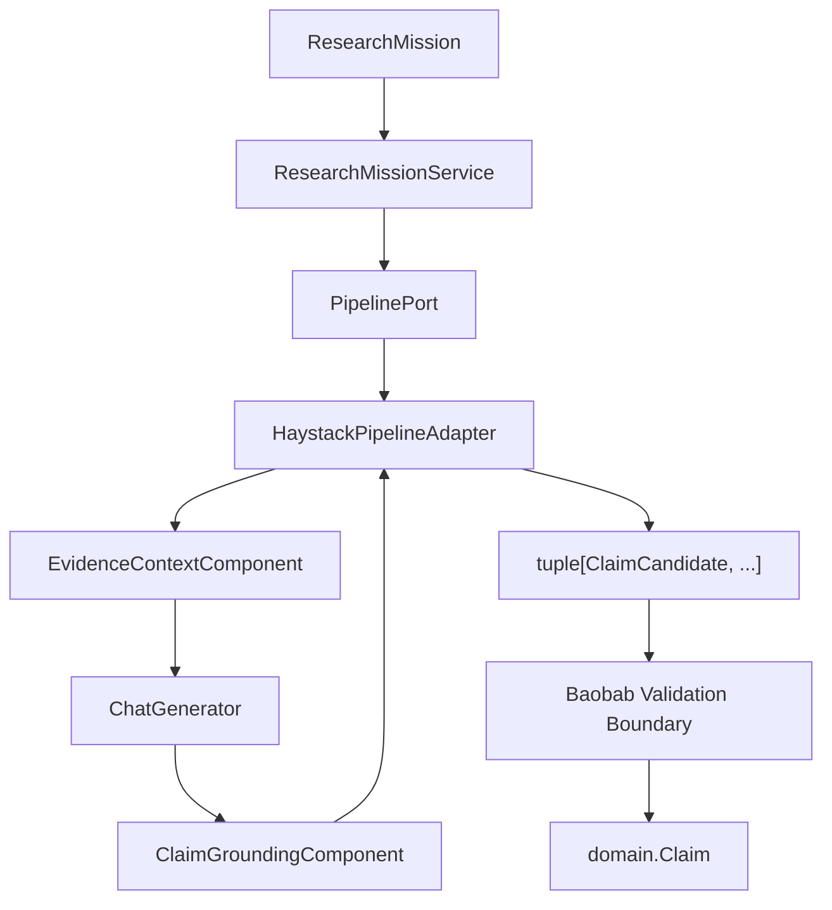
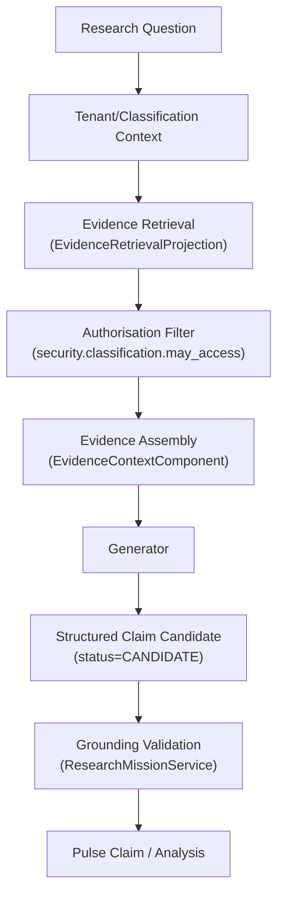

# ADR-PULSE-010: Embedding Deepset Haystack as Pulse's Headless AI Orchestration Engine

**Status:** Accepted
**Classification:** Baobab Pulse Architecture — Implementation Decision
**Repository:** `nabhold/baobab-pulse`

## Numbering note

`ARCH-PULSE-001` §97 reserves `ADR-PULSE-010` for "Tenant Isolation and Data
Classification." This ADR takes that number instead because the Haystack
integration decision became necessary during initial scaffolding —
before tenant isolation could be designed in detail — and ADR-PULSE-001
§97 itself allows this ("additional ADRs may be introduced as
implementation discovers genuine architectural decisions"). The
originally-planned Tenant Isolation and Data Classification ADR should be
filed as `ADR-PULSE-011` (or later) when written.

## Context

Baobab Pulse needs AI orchestration — components, pipelines, agents,
tools, retrieval, generation — to implement its research/RAG/analysis
capabilities (`ARCH-PULSE-001` §50-52). The platform brief and
`ARCH-PULSE-001` are explicit that this capability must sit *behind* Pulse's
canonical domain, never define it: "Haystack is the intelligence
orchestration engine used by Pulse. Haystack is not the Baobab Pulse domain
model, platform contract, tenant model, evidence model, Control Plane or
public API."

## Decision

Use **deepset Haystack**, pinned to **`haystack-ai==3.1.1`**, as Pulse's
embedded, headless AI orchestration engine, entirely behind the
anti-corruption layer at `src/baobab_pulse/infrastructure/haystack/`.

## Version verification (item 7)

Verified directly against PyPI's JSON API (not training-data recall, and
not an LLM-summarized web fetch — an early web-search summary in this same
investigation incorrectly suggested Haystack was still on a 2.x line;
the raw PyPI metadata below is the ground truth this decision is based on):

```text
$ curl -s https://pypi.org/pypi/haystack-ai/json | jq '.info.version, .info.requires_python'
"3.1.1"
">=3.10"

Programming Language :: Python classifiers on 3.1.1:
  3.10, 3.11, 3.12, 3.13, 3.14
```

**Python 3.14 is officially supported by Haystack 3.1.1** — there is no
version gap between `ARCH-PULSE-001`'s target runtime (Python 3.14) and
Haystack's own support matrix. `pyproject.toml` declares
`requires-python = ">=3.14"` accordingly; no downgrade was necessary.

**Toolchain caveat, not an architecture gap:** this scaffold's sandboxed
development session could only install a pre-release CPython build
(`3.14.0rc2`, via `uv python install 3.14`) — a *tooling* limitation of that
one environment, not a real unavailability of final Python 3.14 releases
(the org's `baobab-dev` image already ships `3.14.6`, a final release, per
its `config/versions.yaml`). That specific pre-release build has a
reproducible, unrelated-to-Pulse incompatibility with Pydantic 2.13.5's
`typing._eval_type` usage (`TypeError: _eval_type() got an unexpected
keyword argument 'prefer_fwd_module'` — reproducible with a bare
`class Foo(BaseModel): x: str`, i.e. nothing about this codebase). To
verify this repository's logic in that session despite the sandbox's stale
Python registry, the test suite was additionally run against Python 3.13
(also fully supported by both Haystack 3.1.1 and Pydantic 2.13.5). CI and
any real deployment MUST run on the org's actual `baobab-dev` runtime
(Python 3.14.x final) — Python 3.13 is a verification convenience for this
one sandboxed session, never a target runtime for this repository.

## Haystack 3.x, not 2.x

Haystack's major version jumped to 3.x since most publicly circulated
Haystack examples (including much of this model's own training data) were
written against the 2.x line. Concretely different in 3.x and load-bearing
for this codebase:

- `@component` + `@component.output_types(...)` + `run()` returning a
  `dict[str, Any]` is still the component contract (confirmed by reading
  `haystack/core/component/component.py` and a real component,
  `MockTextEmbedder`, from the installed 3.1.1 wheel) — this part carried
  over from 2.x.
- `Agent`, `Tool`, `AgentTool`, and context-compaction are new/expanded in
  3.x (`haystack.components.agents.Agent`, `haystack.tools.Tool`).
- Deterministic, credential-free test doubles ship in core:
  `haystack.components.generators.chat.MockChatGenerator` and
  `haystack.testing`/`InMemoryDocumentStore` — this is what makes
  `tests/integration/test_haystack_reference_pipeline.py` and the
  reference pipeline itself require zero API keys (item 95-97).
- No separate document-store/generator integration packages were needed for
  this scaffold: `haystack-ai==3.1.1` alone bundles `InMemoryDocumentStore`,
  `MockChatGenerator`, and `OpenAIChatGenerator` (OpenAI's SDK is a core
  dependency of `haystack-ai` itself) — satisfying item 8 ("install only
  integrations required by the initial scaffold") without installing
  `openai-haystack`, `anthropic-haystack`, or any vector-database
  integration.

All of the above was confirmed by downloading and inspecting the actual
`haystack_ai-3.1.1-py3-none-any.whl` (not assumed from memory), since the
governing brief explicitly warns against relying on stale 1.x/2.x examples.

## Component / pipeline architecture



Only two Pulse-authored Haystack components exist
(`EvidenceContextComponent`, `ClaimGroundingComponent`) plus one pipeline
(`pipelines.research_pipeline.build_research_pipeline`) — the minimum
needed to prove the architecture (item 13: "establish the extension
mechanism and one or two minimal reference components sufficient to prove
the architecture," not an exhaustive component catalogue).

## RAG over governed evidence, not naive vector search



Explicitly **not**: `Question -> Vector Search -> LLM -> Answer`. There is
no vector database in this scaffold (item 31) — `InMemoryDocumentStore`
serves the reference pipeline's small synthetic evidence set; a real
deployment introduces embedding-based retrieval only once workload evidence
justifies it, per item 31/114.

## Agent/tool support

See `docs/security/agent-and-tool-security.md`. No Haystack `Agent` is
instantiated in this codebase yet; the `BaobabToolContract` adapter
(`infrastructure/haystack/tools/tool_adapter.py`) exists so that when one
is added, mutating side effects and `EXECUTE`-level authority are refused
by construction, not by convention.

## Provider neutrality

`infrastructure/haystack/generators/model_execution_adapter.py`'s
`build_chat_generator(provider, ...)` is the only place a provider string
(`"openai"`, `"mock"`, ...) resolves to a concrete Haystack Generator class.
Pulse's own `ModelExecutionPort`/`ModelVersion` never reference a Haystack
type.

## Headless operation

No Haystack UI, Studio, or admin surface is embedded — Pulse exposes
research capability through `api.routers.research_missions` (a plain REST
resource) and the reference pipeline is invoked programmatically. Nothing
in this repository imports a Haystack UI package (none is even a
dependency).

## Anti-corruption boundary

Enforced mechanically, not by convention:

- `tests/architecture/test_dependency_boundaries.py::test_only_the_haystack_infrastructure_package_imports_haystack`
  scans every `.py` file outside `infrastructure/haystack/` and fails the
  build if any of them imports `haystack`.
- `infrastructure/haystack/errors.py` translates every Haystack/provider
  exception into `PulseHaystackError` before it can escape the package.
- `application.ports.pipeline_port.ClaimCandidate` /
  `PipelineExecutionResult` are plain Pydantic models — proven by
  `tests/integration/test_haystack_reference_pipeline.py` actually running
  the real `haystack.Pipeline` and asserting the result crossing back out
  is these plain types.

## Alternatives considered

- **LangChain / LlamaIndex.** Rejected for the same reason `ARCH-PULSE-001`
  rejects "Pulse as LLM Agent Platform" generally: the governing concern is
  keeping *any* orchestration framework behind a port, not a preference
  between frameworks. Haystack was selected because the org's own brief
  named it explicitly as the intended engine.
- **No framework — hand-rolled orchestration.** Would still need a
  component model, pipeline execution, retrieval, and tool-calling
  abstractions eventually; reinventing them inside `infrastructure.haystack`
  gains nothing over using a maintained framework already isolated behind
  a port.

## Risks

- **Framework churn.** Haystack moved from 2.x to 3.x with a materially
  different `Agent`/`Tool` surface; a future 4.x could do the same. Mitigated
  by the anti-corruption boundary itself — a rewrite is scoped to
  `infrastructure/haystack/` and its one reference pipeline/two components.
- **Pydantic/Python pre-release interactions** (see the toolchain caveat
  above) — mitigated by pinning `haystack-ai==3.1.1` and `pydantic>=2.9,<3`
  exactly, and by CI running on the org's real `baobab-dev` Python 3.14.x,
  not a pre-release build.
- **`MockChatGenerator` divergence from real providers.** The reference
  pipeline's determinism guarantee only covers the mocked path; provider
  integration tests (not yet written — item 97) are the intended, separate
  gate for real-provider behaviour before it reaches production traffic.

## Upgrade strategy

Before adopting a new Haystack minor/major version (item 108-109):

1. Re-run `tests/integration/test_haystack_reference_pipeline.py` and
   `tests/architecture/*` unchanged — a passing suite is the regression
   gate.
2. Re-verify the pinned version against PyPI's JSON API the same way this
   ADR did, not from memory or a web-search summary.
3. Re-inspect `EvidenceContextComponent`/`ClaimGroundingComponent`/
   `HaystackPipelineAdapter` against the new version's component/pipeline
   contract (`@component`, socket names, `Pipeline.connect` semantics).
4. Bump `PIPELINE_VERSION` in `infrastructure/haystack/pipelines/research_pipeline.py`
   only if the upgrade changes the pipeline's actual behaviour — a
   dependency bump alone does not require a new version if outputs are
   provably unchanged.

## Exit strategy

Per the platform brief's "Final Architectural Test": replacing Haystack
entirely requires rewriting `infrastructure/haystack/` (pipeline adapter,
two components, one pipeline, tool adapter, generator adapter, tracing
bridge, document-store projection) and nothing else. Every canonical
concept — `ResearchMission`, `Claim`, `EvidenceSet`, `Observation`,
`Insight`, `Opportunity`, `Risk`, `Recommendation`, `Decision`, tenant
context, the API surface, and the event contracts — is defined in
`baobab_pulse.domain`/`baobab_pulse.application`/`baobab_pulse.contracts`
and imports nothing from Haystack. `tests/architecture/` is the standing
proof of this, re-run on every CI build.
