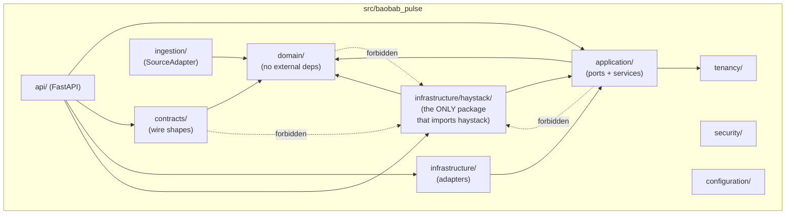
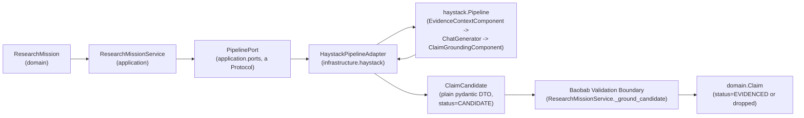
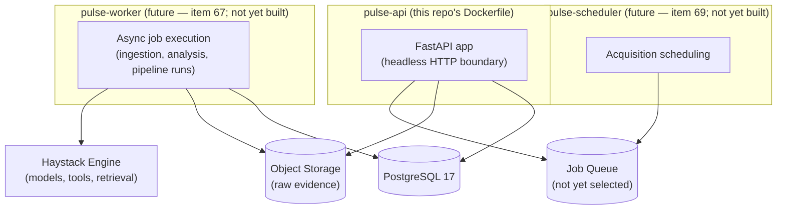

# Baobab Pulse — Architecture Overview

This document orients a reader across the repository's actual package
layout, dependency direction, and deployment shape. It is a map, not a
decision record — decisions live in `docs/adr/`.

## What Pulse is (and is not)

See the root `README.md` and `docs/adr/Baobab Pulse Intelligence Engine.md`
(`ARCH-PULSE-001`) for the full statement. In one line: Pulse turns
heterogeneous internal and external evidence into traceable, contextualised,
time-aware intelligence, without becoming the system of record for the
operational domains that evidence describes.

## Package layout and dependency direction

`tests/architecture/test_dependency_boundaries.py` enforces the solid
arrows' absence in the wrong direction mechanically (AST import scanning),
not by convention alone.

## The Haystack anti-corruption boundary

Every arrow crossing from `Adapter` back out is a plain Python/pydantic
type — never a `haystack.*` class. See
`docs/adr/ADR-PULSE-010 — Embedding Deepset Haystack as Pulse's Headless AI Orchestration Engine.md`
for the full reasoning, and
`tests/integration/test_haystack_reference_pipeline.py` for this exact flow
executing deterministically.

## Deployment topology

Only `pulse-api` exists as a runnable deployment role today (this
repository's `Dockerfile`/`docker-compose.yml`). `pulse-worker` and
`pulse-scheduler` are reserved roles (item 67-69) — introduced once there is
a real asynchronous workload to run, not speculatively.

## Data flow (the canonical pipeline)

This scaffold implements a thin, verifiable slice of this chain (Acquire
via `ReferenceSourceAdapter`, Normalise via `ingestion.pipelines.normalisation`,
and Analyse/Explain via the reference Haystack research pipeline) — the
full chain is not built out (item 113: no premature business code).

## Research / RAG flow

See `docs/adr/ADR-PULSE-010 — Embedding Deepset Haystack as Pulse's Headless AI Orchestration Engine.md`
§"RAG over governed evidence" for the flow diagram and why it is not naive
vector-search RAG.

## Agent/tool security

See `docs/security/agent-and-tool-security.md`.

## API framework decision

See `docs/architecture/api-framework-decision.md`.
