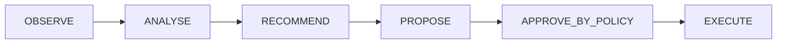

# Agent and Tool Security

Governs how `infrastructure.haystack.tools.tool_adapter` and any future
Haystack `Agent` usage relate to the platform's authority ladder
(ADR-PULSE-001, "Automation Authority Levels"):

## What is enforced today

- **`BaobabToolContract` is mandatory** (`infrastructure/haystack/tools/tool_adapter.py`)
  — every field item 20 requires (name, purpose, input/output contract,
  required permissions, tenant scope, side-effect classification, audit
  behaviour, timeout, failure semantics) is a real, validated field. There
  is no code path to hand a bare Python function to a Haystack `Agent`
  without going through this contract.
- **`ToolSideEffect.MUTATING` is refused outright.** `to_haystack_tool()`
  raises `ToolAuthorityRefusedError` for any contract declaring a mutating
  side effect (item 22: no governed action contract for autonomous
  operational mutation exists yet). This is enforced in code, not
  documentation — see `tests/unit/infrastructure/test_tool_adapter.py`.
- **`AutomationAuthorityLevel.EXECUTE` is refused outright**, for the same
  reason (item 21: initial agents are `READ_ONLY`/`ANALYSIS_ONLY`).
- **Tenant context cannot be silently omitted.** A `tenant_scoped=True`
  contract's governed wrapper calls
  `tenancy.context.require_tenant_context()` before invoking the underlying
  function — a tool call outside a bound tenant context raises
  `TenantContextMissingError` rather than running with no tenant filter.
- **Every governed call is audited** (structured log entry with tool name,
  authority level, side effect) when `contract.audit` is true (the default).
- **A timeout is enforced** (`ThreadPoolExecutor` + `future.result(timeout=...)`),
  so one tool call cannot hang a pipeline/agent indefinitely.
- **Retrieval is classification-filtered before it reaches a generator.**
  `infrastructure.haystack.document_stores.in_memory_projection.build_documents`
  calls `security.classification.may_access` per evidence entry — evidence
  above the requester's clearance is never turned into a `Document`, so it
  never reaches a prompt (item 50).
- **Prompt injection boundary.** `infrastructure.haystack.components.evidence_context_component`
  puts fixed system policy in the system-role message and all evidence
  content in the user-role message, explicitly labelled untrusted (item 41,
  81). External evidence has no code path into the system role.

## What is explicitly out of scope for this scaffold

- No Haystack `Agent` is instantiated anywhere in this codebase yet — the
  tool adapter and its refusal rules exist so that when one is added, it
  is added onto an already-governed foundation, not bolted on afterward.
- `ToolCategories` beyond a bare `Tool` (SourceTool, EvidenceTool,
  ResearchTool, ...) are not implemented (item 24: "do not implement
  unnecessary tools during scaffold").
- Cross-tenant retrieval/synthesis is not implemented or reachable through
  any tool (item 52).
